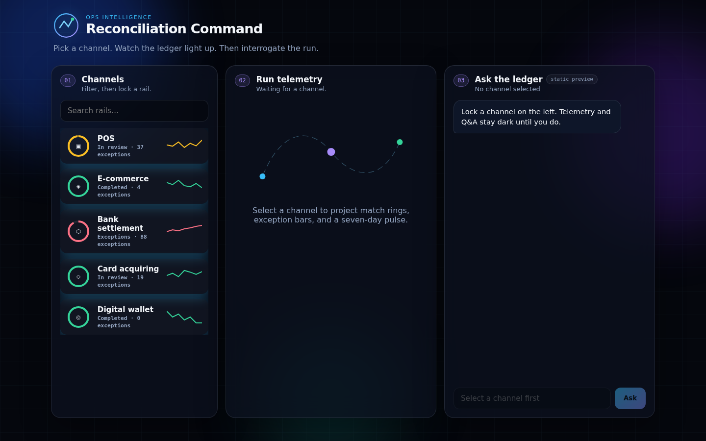
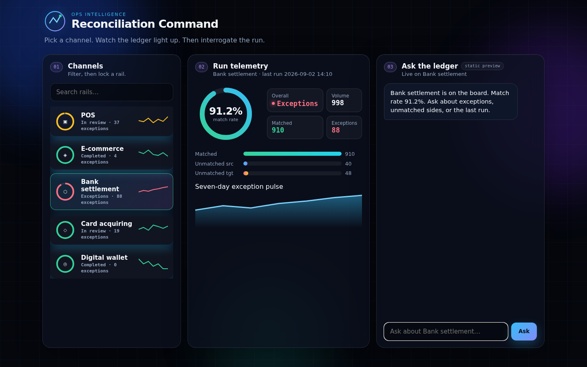

# Reconciliation Command

A single-page ops dashboard for reviewing payment-channel reconciliation runs — pick a rail, watch the match rate, exceptions and 7-day pulse render, then ask the ledger a question about what you're looking at.



## What it does

- **Channels** — filter and select a payment rail (POS, e-commerce, bank settlement, card acquiring, digital wallet). Each card shows a live match-rate ring and a sparkline of its exception trend.
- **Run telemetry** — once a channel is selected: match rate, volume, matched/exception counts, unmatched-source vs unmatched-target bars, and a 7-day exception pulse chart, all animated in.
- **Ask the ledger** — a chat panel scoped to the selected channel. Questions are answered **live by Claude**, grounded in that channel's actual run data (no hallucinated numbers — the model is given the full dataset as context).



## Stack

Plain HTML/CSS/JS, no build step, no dependencies:

- `index.html` — markup
- `styles.css` — the dark glass/orb aesthetic
- `app.js` — the mock dataset, chart rendering, and chat wiring

## Live Q&A

"Ask the ledger" calls Claude through the [Artifact `sample` capability](https://claude.ai/code) — each question is sent along with the full channel dataset as context, and the answer streams back in real time. A badge in the panel header shows the actual status:

- **Claude live** — the page is running where Claude sampling is available (e.g. published as a Claude Artifact) and answers are real.
- **static preview** — sampling isn't available in this context (a plain browser tab, GitHub's file preview, etc.); the panel says so instead of faking an answer.

This means the file works two ways:

1. **Opened as a static page** (double-click `index.html`, or serve the folder) — full dashboard, mock data, chat panel gracefully explains that live answers need a Claude-enabled viewer.
2. **Published as a Claude Artifact** with the `sample` capability declared — the chat is fully live.

## Running it locally

No build step — just serve the folder:

```bash
cd reconciliation
python3 -m http.server 8000
# open http://localhost:8000
```

## Data

All channel data (`CHANNELS` in `app.js`) is seeded/mock, built for demoing the UI and the Q&A flow — not a live production feed.
